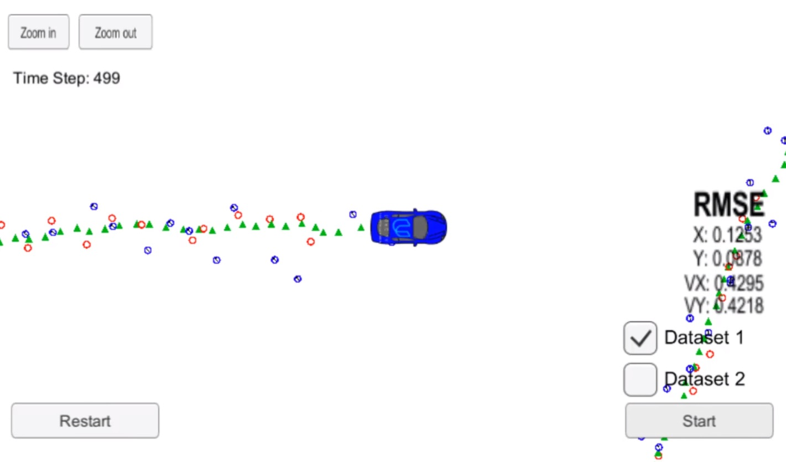

# Extended Kalman Filter 

Skills
---
* Sensor Fusion
  * Extended Kalman Filter
* C++ 

Overview
---

An extended kalman filter is used to interpret noisy lidar and radar measurements from the simulator. The code then plots the position estimate in the simulator, allowing for visual comparison of the estimation versus the actual position. 

This project was completed as an assignment for Udacity's Self Driving Car Nano Degree .

Dependencies
---

* Udacity Term 2 Simulator, which can be downloaded [here](https://github.com/udacity/self-driving-car-sim/releases)
* uWebSocketIO
    * This repository includes two files that can be used to set up and install [uWebSocketIO](https://github.com/uWebSockets/uWebSockets) for either Linux or Mac systems. This project was built using the Udacity Docker image on Windows. Instructions for how to do that can be found [here](https://discussions.udacity.com/t/getting-started-with-docker-and-windows-for-the-ekf-project-a-guide/320236)
* cmake >= 3.5
  * All OSes: [click here for installation instructions](https://cmake.org/install/)
* make >= 4.1 (Linux, Mac), 3.81 (Windows)
  * Linux: make is installed by default on most Linux distros
  * Mac: [install Xcode command line tools to get make](https://developer.apple.com/xcode/features/)
  * Windows: [Click here for installation instructions](http://gnuwin32.sourceforge.net/packages/make.htm)
* gcc/g++ >= 5.4
  * Linux: gcc / g++ is installed by default on most Linux distros
  * Mac: same deal as make - [install Xcode command line tools](https://developer.apple.com/xcode/features/)
  * Windows: recommend using [MinGW](http://www.mingw.org/)

Build Instructions
---

Once the install for uWebSocketIO is complete, the main program can be built and run by doing the following from the project top directory.

1. mkdir build
2. cd build
3. cmake ..
4. make
5. ./ExtendedKF

